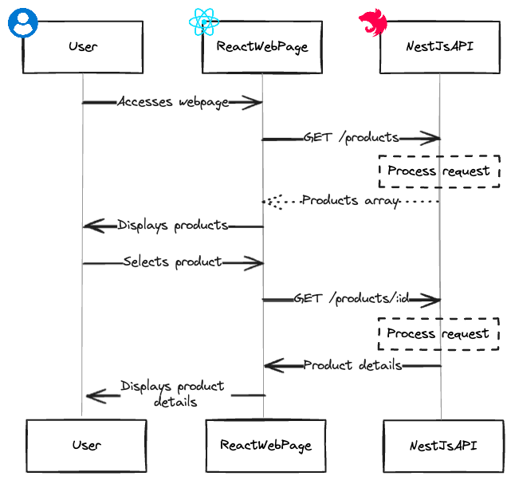
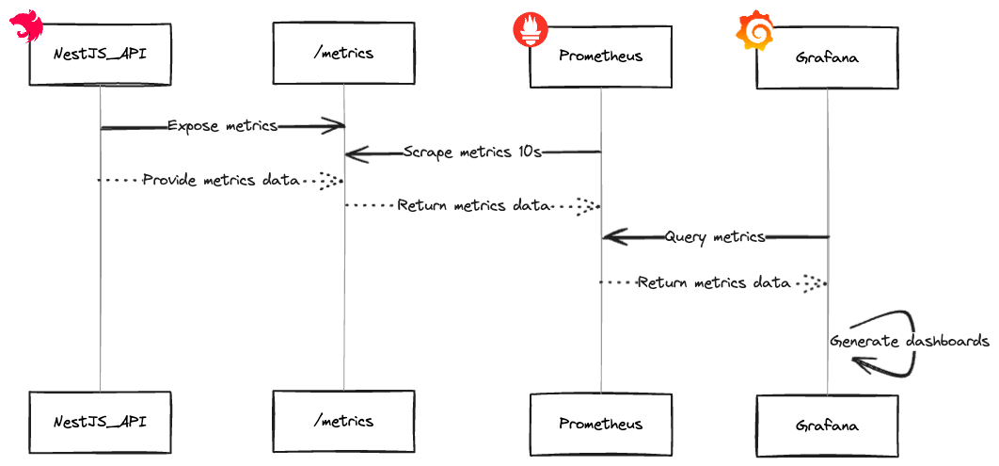

## :motorcycle: Dependencies

Please install Docker from: https://www.docker.com

Please install MySql Workbench from: https://dev.mysql.com/downloads/workbench/

## :round_pushpin: Setup

You can run `docker-compose up` in a terminal to use a local Docker container for all dependencies and start the components.

> **NOTE:** To generate and populate the database tables please follow the steps below

```bash
cd api
npm install
npm run typeorm:migration:run
```

After running the sample, you can access all the components using the links from -> [Components overview](#round_pushpin-components-overview)

You can stop the Docker container with `docker-compose down`

## :round_pushpin: Architecture





## :round_pushpin: Components overview

| Component | URL | User | Password |
| :--- |  :--- | :---: | :---: |
| API | http://localhost:4000/docs | - | - |
| Web Interface | https://localhost:3000 | - | - |
| Database | http://localhost:3306 | root | password |
| Prometheus | http://localhost:9090 | - | - |
| Grafana | http://localhost:3001 | admin | admin |
